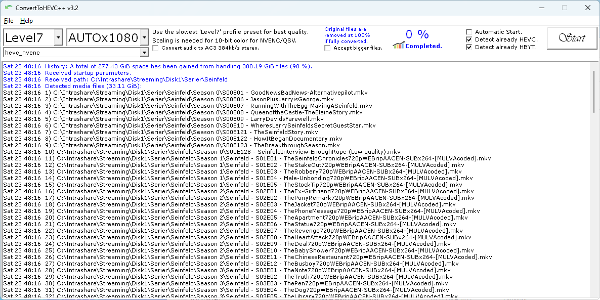

## ConvertToHEVC++ | H.265/HEVC Converter for Windows  

Made to convert H.264 media libraries to H.265/HEVC to save storage capacity.  
Right-click files or entire folders, and/or choose them from within the program. 

  
<br>
   
## Features  

* Hardware accelerated bulk or single conversion of x264 media  
to x265/HEVC via NVIDIA NVENC or INTEL QUICKSYNC. Or software CPU.  

* Automatic recursive search for MKV and MP4 video files via  
Explorer right-click context menu on folder you select.  

* Saves all successful converted video files detected directly  
in their subfolder location where they are found.  

* Supports various quality profiles; Slow, Medium, Fast.  

* Supports bicubic scaling with various settings; 720, 1080, 1440, 2160.  

* Existing HEVC videos are kept original when detected (Main, Main 10).  

* Software has been tested to load a queue of over 5000  
(suggested max) files in just a few seconds from SSD.  

* Supports multiple instances. Useful for multitasking if you have streams available.  

* Keeps a history of statistics about storage capacity gained from converting media.  

* Processed files are tagged/named HBYT(HEVC By Thronic).  
Any detected subtitles are also named to match video.  

* Original files that are smaller than the converted version,  
are kept as-is and tagged as well to be ignored on future runs.  

* Failed conversions are kept original and not tagged.  
<br>

## Additional notes about Nvidia  
If you have a consumer grade GeForce card, you are limited by default to 2 simultaneous  hardware encoding streams unless you [patch it](https://github.com/djnedrelid/NvidiaStreamPatch), this is only important if you're going to run multiple instances. Professional Quadro cards are generally unrestricted (except T1000 which is restricted to 3). Converting on a busy Plex server providing hardware accelerated encoding to users may cause conversions resulting in (Failed) and log "out of memory" errors in the ffmpeg log. This is normal. Your options are to patch the driver, do the work on a  dedicated computer without other accelerated tasks interfering (gaming not included, it will use GPU not NVENC), or get a Quadro card.  

The card needs to have [NVENC Support](https://developer.nvidia.com/video-encode-and-decode-gpu-support-matrix-new). I recommend any Turing based card or later. This would generally mean certain GTX 1050 cards, Quadro T1000 or later.  
<br>

## Current command line arguments available 
1. **"c:\path\to\videofile"** (must be first argument).  
2. **autostart** (starts conversion automatically).  
3. **encoder=hevc_nvenc|hevc_qsv|libx265|libsvtav1**  (how to encode).  
4. **EXITWHENDONE** (exits program when done).  
5. **DOWNMIX** (downmixes audio to stereo).  
6. **scaling=AUTOx1080** (automatic width proportional to chosen height from 720 to 2160).  
7. **quality=Level1|Level2|Level3|Level4|Level5|Level6|Level7** (Level7 = best).  
<br>

**Example usage from command line**:  
```"C:\Program Files\Thronic\ConvertToHEVC++\ConvertToHEVC++.exe" "C:\Users\Administrator\Downloads\video.mkv" autostart EXITWHENDONE DOWNMIX scaling=AUTOx1080 quality=Level7 encoder=hevc_nvenc```
<br>

## Changelog  
**2024.12.7 Updated release v3.2**  
[+] Updated ffmpeg binary. Using latest full from gyan.dev  
[+] Added 7 new quality profiles and removed deprecated ones.  
[+] Added AV1 software encoding, using SVT-AV1(libsvtav1).  
[+] Hardware encoders will now encode to 10-bit colors when scaling.  
[+] CPU profiles will now encode to 10-bit colors always.  
[+] All encoders have been tuned slightly towards quality.  
[+] Can now load file and folder from within the program.  
[+] Setup/Update will now therefore add a shortcut to the desktop.  
[🛠] Minor fixes related to settings when using autostart.  
  
**NOTE**: Some of these changes may require you to revise your scheduled commands!  
**NOTE**: I considered adding av1_nvenc and av1_qsv but hardware requirements are too high for me to test.  
  
**2024.11.28 Updated release v3.1**  
[+] Added support for software(libx265) CPU encoding (gpu=cpu).  
[🛠] Save history db should no longer be reset when updating.  
  
**2024.11.10 New release v3.0**  
[+] Added support for Intel Quicksync conversion!  
Available via scroll menu and 'gpu=nvidia|intel' argument.  
[🛠] Fixed Main 10 detections that would go unnoticed.  
[🛠] Improved error logging for missing gpu.  
  
**2024.11.1 Updated release v2.0**  
[🛠] Changed back to AC3 (Dolby Digital) due to better toslink/optical TV transfer support. Still 384kb/s.  
  
**2024.9.26 New release v2.0**  
[🛠] Changed downmixing codec from AC3 to EAC3 (Dolby Digital Plus) with 384k bitrate.  
  
**2024.4.7 New release v1.9**  
[🛠] Fixed a bug in 1.8 where it would fail if there was no subtitles to copy (-map 0:s?).  
[🛠] Changed downmixing codec from AAC to AC3 with 384k bitrate for broader entertainment hardware support.  
[+] Updated ffmpeg binary to latest available full version for best possible transcoding (latest codecs).  
  
**2024.4.5 New release v1.8**  
[+] Added the command line argument DOWNMIX for downmixing surround sound to stereo.  
  
**2022.9.26 New release v1.7**  
[+] Added 3 extra command line arguments.  
  
The scaling and quality arguments MUST match an in-program option, and they are case-sensitive. These 2 arguments will be saved as new defaults; since they are a part of the statistical save routine. EXITWHENDONE will exit the program automatically after completion. The autostart will automatically start the process, even if the setting is not enabled. These arguments are intended for scheduled tasking, and it's OK to run multiple instances.  

**2021.5.7 Update for v1.6**  
[🛠] Swapped an internal check against failed results with less than 99% saved instead of larger than 0 bytes. A user reported a rare error where a result would be a few KiB and pass previous test.  

**2021.5.1 Latest version v1.6 released May 1st, 2021**  
[+] Now has a checkbox for “Accept bigger files”. Useful when upscaling.  
[+] Self-repair code added for the database.  
A user submitted db had an invalid unsigned long long value logged.  
  
**2021.2.1 Update for v1.4**  
[🛠] Updated info text for scaling.  
[+] Added 2 new scaling presets AUTOx480, AUTOx576.  
  
**2021.1.29 New release v1.4**  
[🛠] Fixed a bug where if a queue had been interrupted and a 0 byte HBYT file was left behind, future processing of that file would silently fail if original was HEVC.  
[+] User requested feature: Support for 3rd argument EXITWHENDONE so it can be scheduled to run in e.g. taskschd.msc. Remember to put 2nd argument (folder or filename to convert) in quotes("") if you use this feature.  
[+] User requested feature: New checkbox for not detecting HEVC, for when you want to transcode it anyway (scaling etc).  
[+] New feature: New checkbox for not detecting HBYT tagged files, for when you want to re-process files for any reason.  
  
**2021.1.11 Update for v1.3**  
[🛠] Existing HEVC files are now tagged HBYT as well, instead of being entirely skipped.  
  
**2021.1.9 New release v1.3**  
[🛠] Improvements and fixes. Improved pre-existing HEVC detection by altering the regular expression used. Fixed a bug where filename searches would include directory as well, causing destination file error. Only affected by directory names containing encoding type in the name (x264, h.264 etc).  
  
**2021.1.6 New release v1.2**  
[🛠] Statistics behavior has been changed from saving to DB after full completion, to saving after every converted file. This will make sure that every converted file is a part if history, even if a batch job has been interrupted and/or cancelled.  
  
**2020.12.21 New release v1.1**  
Minor bug fixes and improvements.  
  
**2020.12.18 Initial release**  
Initial release, v1.0  
  
**Third party licensing**  
ConvertToHEVC++ is powered by https://www.ffmpeg.org/.  
The enclosed ffmpeg.exe executable is licensed under GPL v3.  